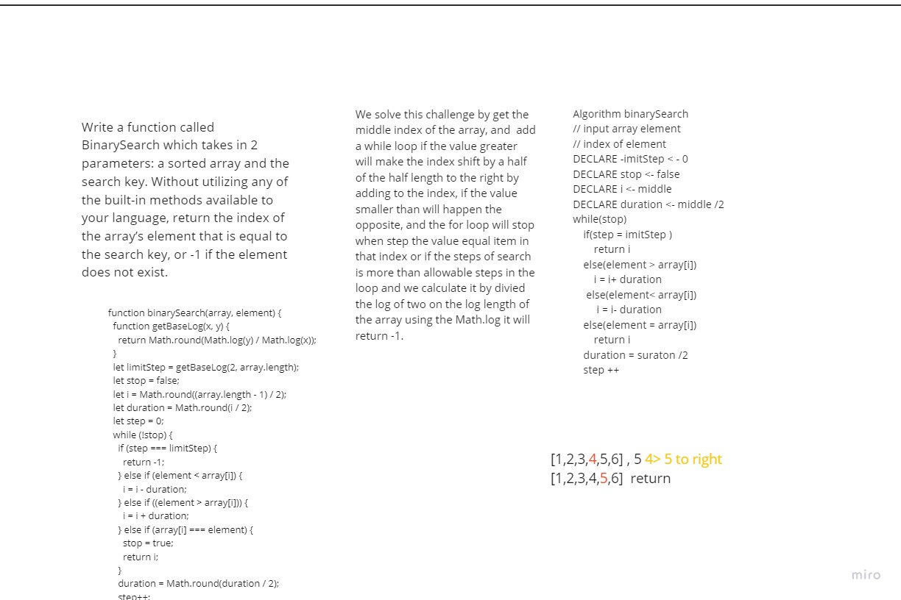

# Array Binary Search
A function that take two argument, the first argument is an sorted array and the second argument represent a value, the functionality here to return the index of the value inside the array.  

## Challenge
Write a function called BinarySearch which takes in 2 parameters: a sorted array and the search key. Without utilizing any of the built-in methods available to your language, return the index of the array’s element that is equal to the search key, or -1 if the element does not exist.

## Approach & Efficiency
We solve this challenge by get the middle index of the array, and  add a while loop if the value greater will make the index shift by a half of the half length to the right by adding to the index, if the value smaller than will happen the opposite, and the for loop will stop when step the value equal item in that index or if the steps of search is more than allowable steps in the loop and we calculate it by divied the log of two on the log length of the array using the Math.log it will return -1.

## Solution
