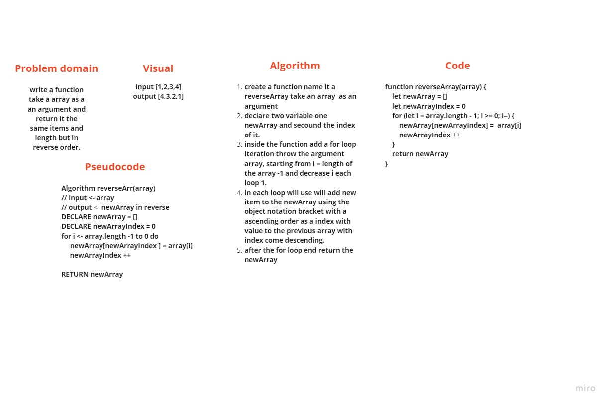

# Reverse an Array
A function that takes an array of items and outputs a new array with the items from the initial array reversed.
function take a array of items as an argument and will return a new array with same items and length but in reverse order.

## Challenge
Write a function called reverseArray which takes an array as an argument. Without utilizing any of the built-in methods available to your language, return an array with elements in reversed order.

## Approach & Efficiency
As the challenge requirement, we not allowed using built-in methods, then we use two counters in one for loop, first one to iteration descending order through the argument array and the second one to iteration ascending order through the new array (output) using object notation bracket, at each loop we add new item in our new array that represent the same array but in reverse order. 

## Solution
