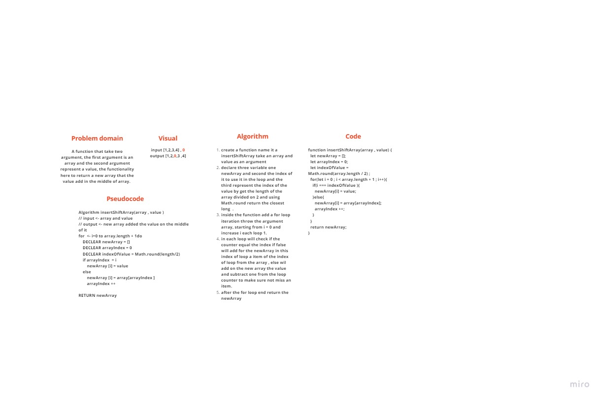

# Reverse an Array
A function that take two argument, the first argument is an array and the second argument represent a value, the functionality here to return a new array that the value add in the middle of array.   

## Challenge
Write a function called insertShiftArray which takes in an array and the value to be added. Without utilizing any of the built-in methods available to your language, return an array with the new value added at the middle index.

## Approach & Efficiency
We solve this challenge by get the length of the given array and divied it divide on 2 to get the index of the value on the new array, using the for loop we iterate on each item on the array and stop when the array counter of the loop equal the index of the new value and add the value on the new array and subtract one from the index counter to make sure not missing any of the items in the previous array.

## Solution
