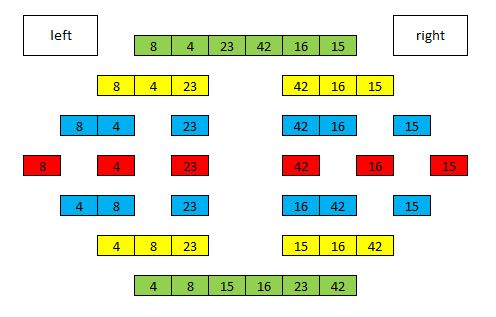

# Merge Sort
Merge sort is one of the most popular sorting algorithms today and it uses the concept of divide and conquer to sort a list of elements.

## Challenge 
Write a function that take a arr as an argument and return a arry sorted using the merge sort algorithm.

# Solution

